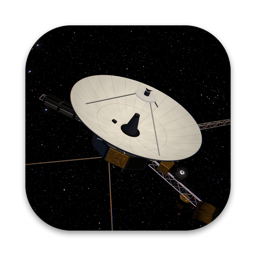
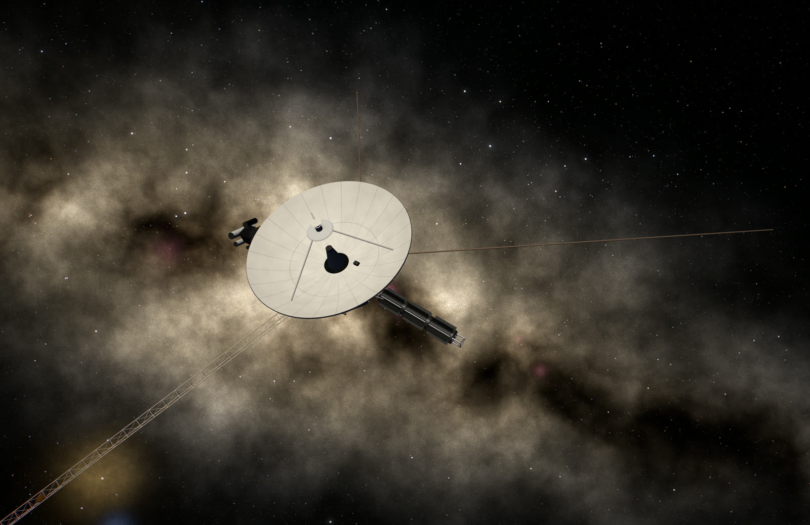
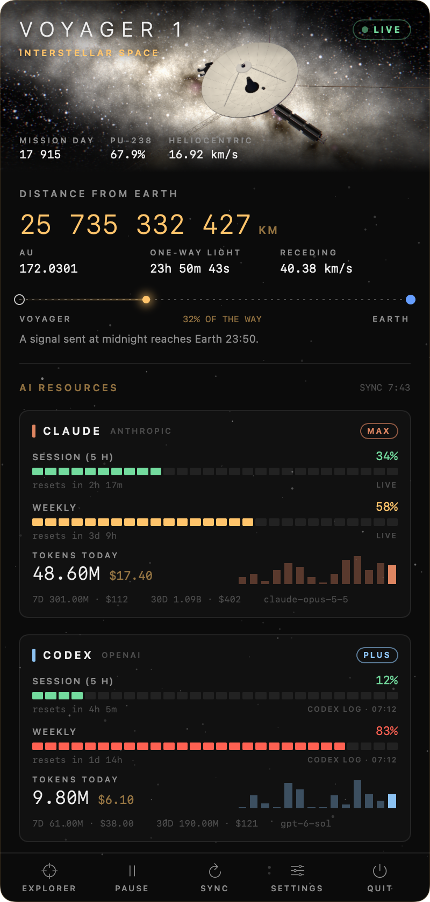
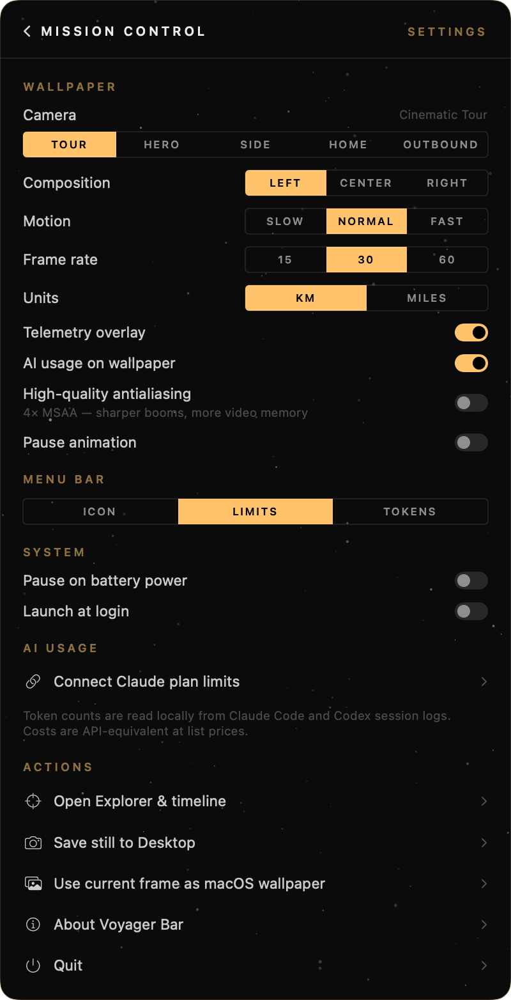
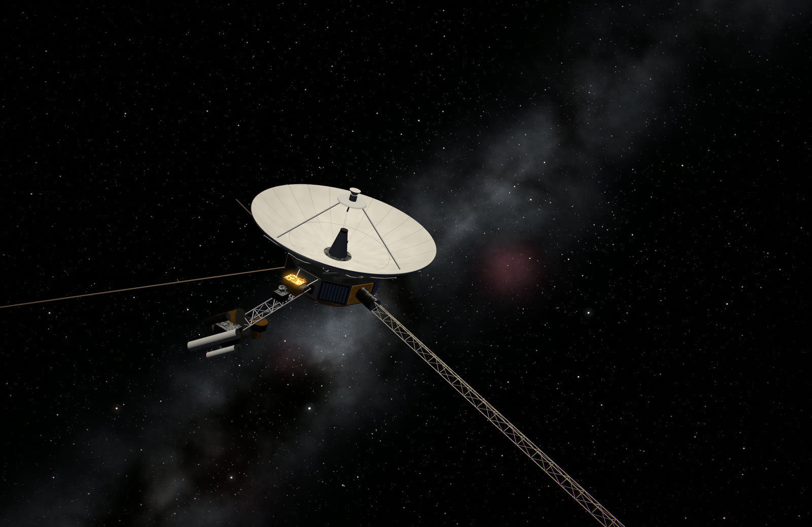
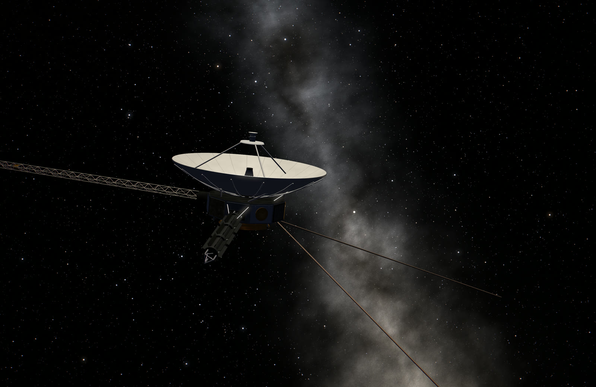
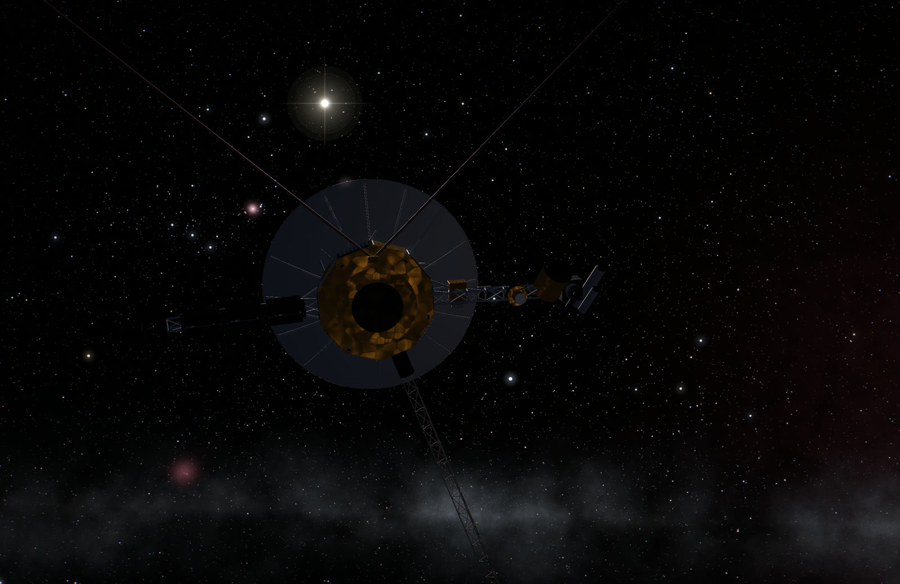
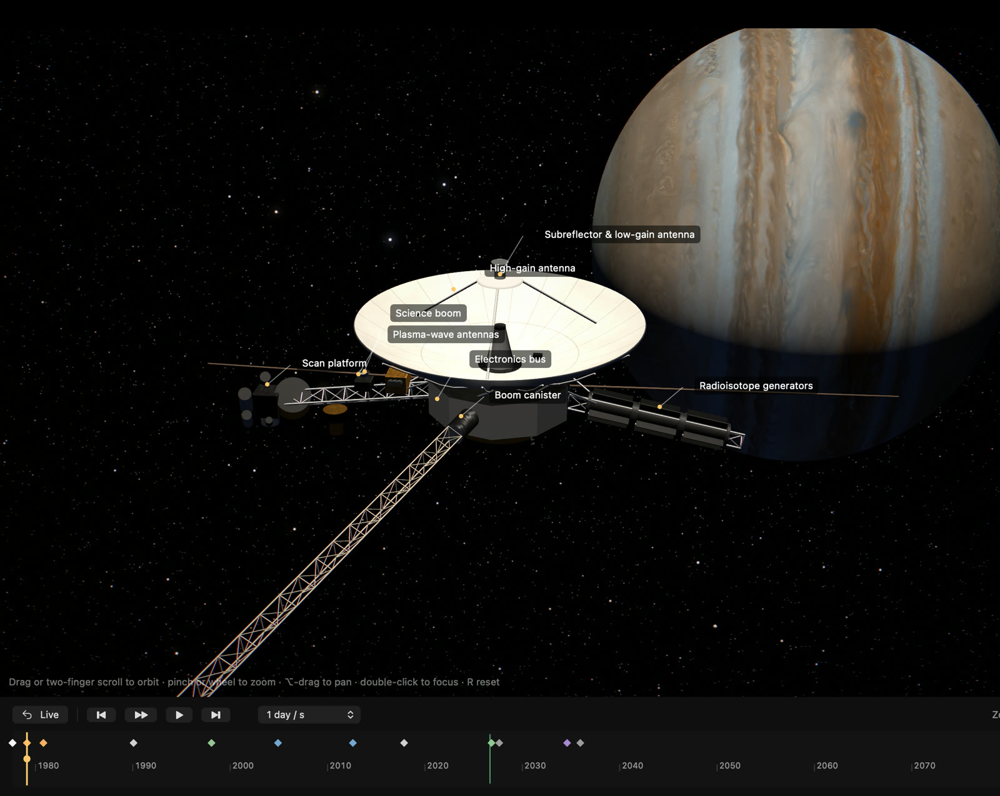
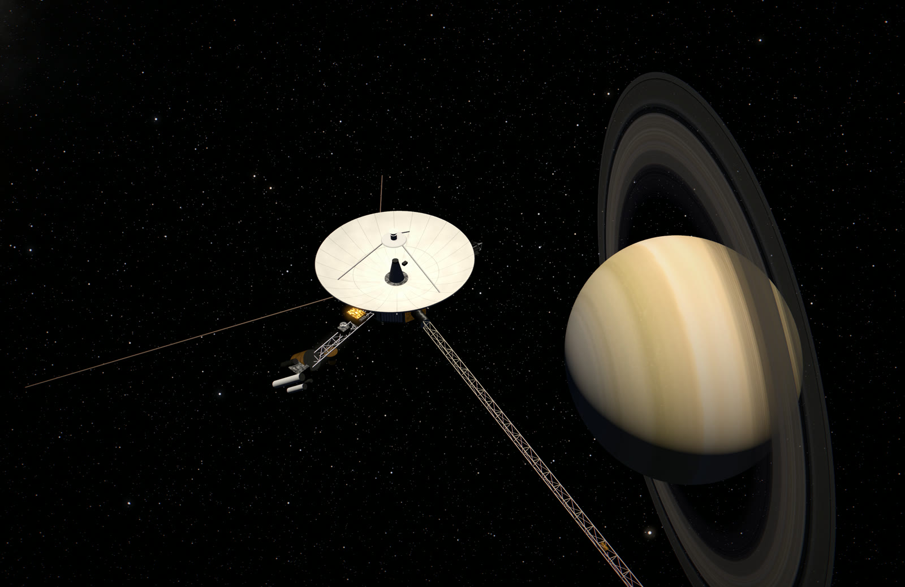
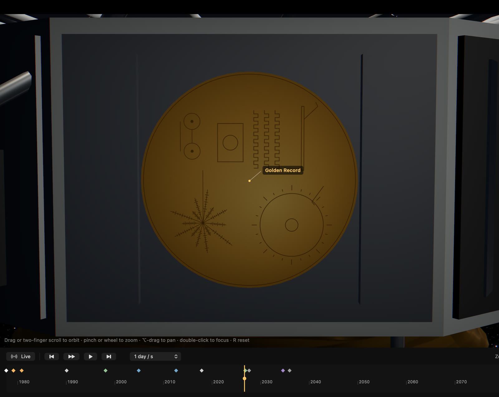

<p align="center"></p>

<h1 align="center">Voyager Bar</h1>

<p align="center">
A live macOS wallpaper of <b>Voyager 1</b> in interstellar space — real sky, real trajectory,
a time machine from 1977 to AD 1 000 000 — plus a mission-control menu bar panel that
tracks your <b>Claude</b> and <b>OpenAI Codex</b> token usage and plan limits.
</p>

<p align="center"></p>

## Install

**One command** (recommended — installs or updates to the latest release):

```bash
curl -fsSL https://raw.githubusercontent.com/FeN1x1/voyager-bar/main/install.sh | bash
```

**Or download** `VoyagerBar-<version>.dmg` from the [latest release](https://github.com/FeN1x1/voyager-bar/releases/latest),
drag *Voyager Bar* into Applications and open it.

> [!NOTE]
> Voyager Bar is a free, open build that is **not notarized by Apple**. The first time you
> open the DMG version, macOS says it cannot verify the app: click **Done**, then go to
> **System Settings → Privacy & Security** and click **Open Anyway** (once). The install
> script above avoids this step.

Requires **macOS 13 Ventura** or newer, Apple silicon or Intel. The app lives in the menu
bar (a tiny Voyager silhouette) and has no Dock icon; the wallpaper sits behind your
desktop icons on every Space and display.

## Mission control panel

<p align="center">&nbsp;&nbsp;&nbsp;</p>

*Left-click the menu bar icon for the panel, right-click for settings.* (Usage numbers in
these screenshots are illustrative.)

- **Live telemetry** — distance from Earth ticking by the kilometre, light time, range rate,
  mission day, remaining plutonium-238, and where a signal sent at midnight is right now on
  its way to Earth.
- **AI resources** — for Claude Code and Codex: tokens and API-equivalent cost today, over
  7 and 30 days, a 14-day histogram, the top model, and plan limits (5-hour session and
  weekly) as segmented gauges with reset countdowns. The menu bar can show the tightest
  limit per provider, today's tokens, or just the icon.
- **Settings** — camera, composition, motion, frame rate, units, overlays, antialiasing,
  pause on battery, launch at login, saving stills.

### How usage is measured (privacy)

Everything is read **locally**:

- **Claude** — Claude Code's session logs in `~/.claude/projects` (deduplicated per
  message/request, all cache tiers and fast mode priced).
- **Codex** — Codex's session logs in `~/.codex/sessions`; Codex also writes its current
  rate-limit snapshot there, so its plan limits need no network access at all.
- **Claude plan limits** are optional: click *Connect plan limits* once and macOS asks for
  Keychain access to Claude Code's sign-in. Voyager Bar only **reads** it to call the same
  usage endpoint as `/usage`; it never refreshes or writes the token, so Claude Code's login
  is untouched.

Costs are what the tokens would cost at Anthropic/OpenAI list prices — on a subscription
that is not what you pay.

## The wallpaper

| | |
|---|---|
|  |  |
|  |  |

- A **1:1 procedural model**: 3.66 m high-gain antenna with Cassegrain subreflector,
  decagonal bus with louvers and MLI, the Golden Record with its engraved cover, three
  RTGs, the science boom and scan platform, the 13 m magnetometer boom, plasma-wave antennas.
- The **real sky**: 44 000 HYG catalogue stars with B−V colours plus ~170 000 fainter
  stars following the galaxy's density; a procedural Milky Way in galactic coordinates with
  dust lanes, nebulae and the Magellanic Clouds. The antenna points at Earth and the Sun
  shines from where it really is (seen from Voyager it sits near Orion).
- A slow **cinematic tour** chosen so the Milky Way is always in the background, HDR,
  bloom and soft shadows; renders at the panel's native resolution and pauses whenever the
  desktop is covered, the display sleeps or (optionally) on battery.

## Explorer & timeline

<p align="center"></p>

Open **Explorer** from the panel to fly around the spacecraft (drag / two-finger scroll to
orbit, pinch to zoom down to 0.6 m, ⌥-drag to pan, double-click to focus) with labelled
parts, close-ups and an inspection light — and to travel in time:

- **1977 – 2100 · JPL precision.** Daily JPL Horizons state vectors (5-minute steps after
  launch, 10-minute steps through the encounters), Hermite-interpolated to well under a
  kilometre. The linear timeline zooms from a century down to ten minutes.
- **Encounters.** Jupiter with Io, Europa, Ganymede and Callisto (March 1979), Saturn with
  its rings, Titan and five more moons (November 1980): real positions, IAU rotation,
  flattening, lighting, eclipses — and the wallpaper frames them automatically.
- **Deep time · AD 2100 – 1 000 000.** Beyond JPL's prediction Voyager is integrated on its
  hyperbola around the Sun and the stars move along their HYG space velocities, changing
  position and brightness as seen from the spacecraft. Computed milestones include the
  closest approach to Gliese 445 (about 1.9 light-years, around AD 46 600). Marked *extrapolated*.
- Milestones from launch to the Pale Blue Dot, the heliopause and one light-day from Earth
  (18 November 2026); play at up to 1 000 years per second, forwards or backwards. The
  wallpaper and panel follow the simulated date until you return to *Live*.

| | |
|---|---|
|  |  |

## Build from source

```bash
git clone https://github.com/FeN1x1/voyager-bar.git && cd voyager-bar
./build.sh --install      # build (universal) and install into /Applications
./build.sh --dmg          # build build/VoyagerBar-<version>.dmg and .zip
UNIVERSAL=0 ./build.sh    # faster arm64-only build
```

Needs the Xcode Command Line Tools (`xcode-select --install`). No Xcode project, no
dependencies. `python3 tools/prepare_data.py` re-downloads and rebuilds all data files.

Handy flags for development:

```bash
B="build/Voyager Bar.app/Contents/MacOS/VoyagerBar"
"$B" --snapshot out.png --size 3024x1964 --mode outbound --scale 2      # still frame
"$B" --snapshot jupiter.png --mode hero --date 1979-03-05T06:00:00Z    # any date
"$B" --snapshot record.png --part record --studio                      # part close-up
"$B" --usage-report                                                    # token summary
```

| File | What it does |
|---|---|
| `Ephemeris.swift`, `SimClock.swift` | trajectory tables, deep-time integration, shared simulated time |
| `SolarSystem.swift`, `Bodies.swift` | planet & moon positions and rendering |
| `Spacecraft.swift`, `Sky.swift`, `MilkyWay.swift` | the model, stars (custom Metal point shader), galaxy |
| `VoyagerScene.swift` | scene, lighting, cinematic and encounter cameras |
| `ExplorerWindow.swift`, `TimelineView.swift` | Explorer window and timeline |
| `UsageStore.swift`, `UsageLimits.swift`, `UsagePricing.swift` | log scanning, plan limits, prices |
| `MenuPanel.swift`, `StatusGlyph.swift`, `UsageHUDView.swift`, `HUDView.swift` | menu bar panel, icon, overlays |

See [CREDITS.md](CREDITS.md) for data sources and licenses. Unofficial fan project, not
affiliated with NASA, JPL, Anthropic or OpenAI.
